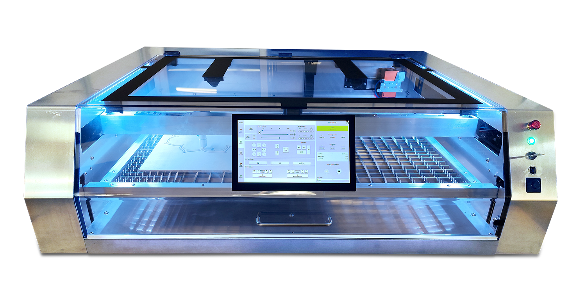
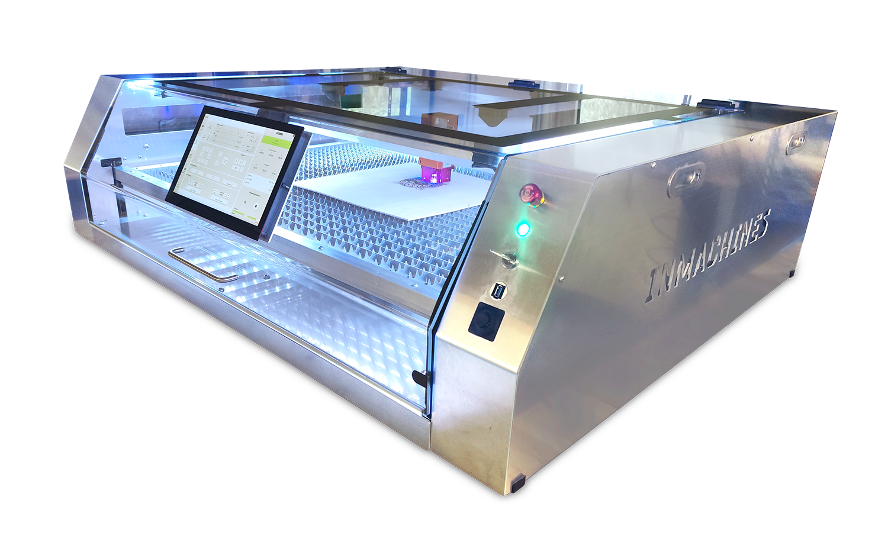
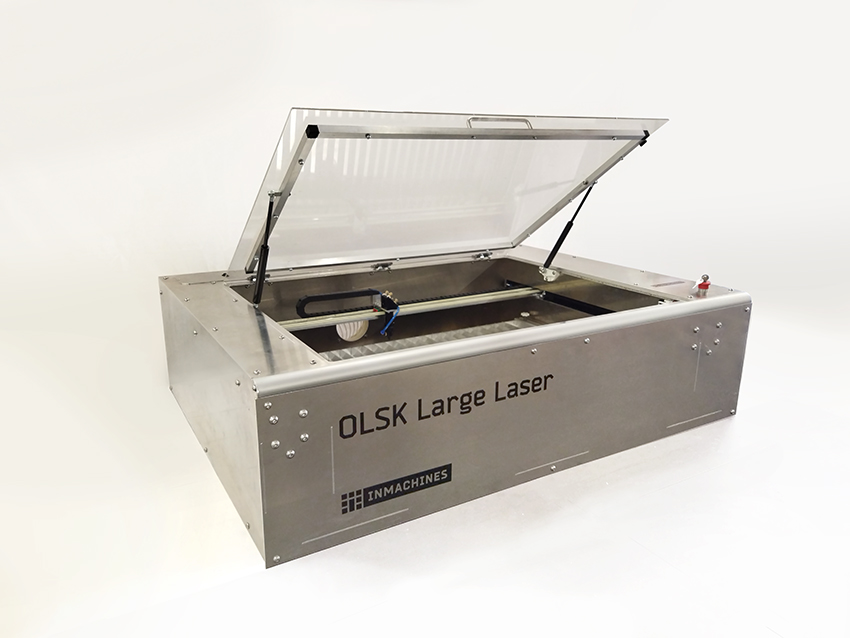

<h1 style=align="center">OLSK Large Laser V3</h1>

<i>Open Source Laser Cutter - Large version - Open Lab Starter Kit</i>

 

Introduction
--

The OLSK Large Laser V3 is the first laser cutter with tool changer, switching the laser source and laser head, using magnetic kinematic coupling. Compatible with multiple laser sources, such as RF CO2 60W and Diode 40W, it automatically changes the focal length and transfers power, data and air. This machine is also the first RF laser cutter, featuring a spring loaded RF laser mount, beam Expander, single point beam adjustment and custom optics mounts. Its innovative chamfered design has a display mounted on the window, integrated light with status indication and dual 16 megapixel camera. The operation is controlled by OLOS, the in-house software, which allows several features such as Gcode generation, job preview, WiFi and ethernet connection, image positioning system and AI image generation.

The Assembly Manual
--

All OLSK machines are open source and have an assembly manual, the BOM and necessary files available in this repository for replication. The assembly manual is an interactive 3D guide though each step and contains a list of parts, tools and instruction remarks, which follows a logic order to provide a smooth assembly.

- **[Assembly Manual](https://open-lab-starter-kit.github.io/OLSK-Large-Laser/)**

Specifications V3
--

- multilaser source compatibility: RF CO2 60W, RF CO2 40W, Diode 40W
- automatic laser source management
- tool changer with magnetic kinematic coupling heads
- automatic focal length
- spring loaded RF laser mount
- beam expander
- single point beam adjustment
- custom optics mount
- all-on-one Micro ATX controller
- fully enclosed housing
- mounted touch screen
- LED status lights
- dual 16 MP camera
- software: OLOS V2
- job preview
- WiFi and Ethernet connection
- integrated Gcode generation
- AI image generator
- camera positioning system

Files
--

- **[CAD](cad)**
- **[Firmware](firmware)**
- **[Settings](settings)**
- **[Wiring Schematic](OLSK_Large_Laser_V3_WiringSchematic.pdf)**
  
Author
--

OLSK Large Laser has been designed and built by **[InMachines Ingrassia GmbH](https://www.inmachines.net/)**.

 
Machine design:

- **[Daniele Ingrassia](https://www.linkedin.com/in/danieleingrassia/)**

The machine is part of the **[Open Lab Starter Kit (OLSK)](https://www.inmachines.net/open-lab-starter-kit)** group of open source digital fabrication machines.

OLSK is developed by **[InMachines Ingrassia GmbH](https://www.inmachines.net/)** for the **[Dtec project](https://dtecbw.de/home/forschung/hsu/projekt-fabcity)** at **[Fab City Hamburg](https://www.fabcity.hamburg/en/)**.

OLSK Partners:
  

Contact
--

- daniele@inmachines.net
- [https://www.inmachines.net/](https://www.inmachines.net/)

License
--

Hardware design, CAD and PCB files, BOM, settings and other technical or design files are released under the following license:

- CERN Open Hardware Licence Version 2 Weakly Reciprocal - **[CERN-OHL-W](LICENSE_CERN_OHL_W_V2.txt)**

Assembly manual, pictures, videos, presentations, description text and other type of media are released under the following license:

- Creative-Commons-Attribution-ShareAlike 4.0 International - **[CC BY-SA 4.0](LICENSE_CC_BY_SA_4.0.txt)**

  
Previous version
--

Previous versions of OLSK machines will always be available. 

**[OLSK Large Laser V1 Repository](OLSK_Large_Laser_V1)** 

